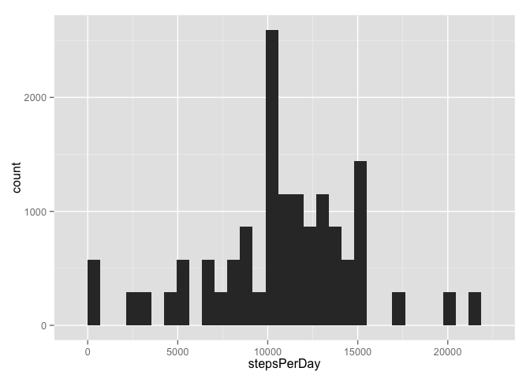
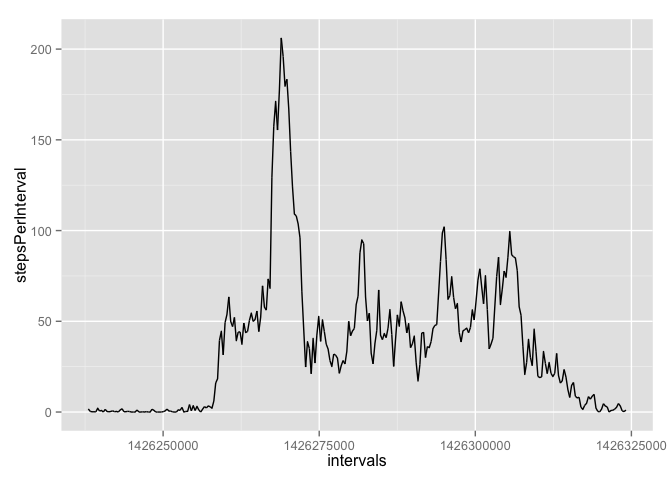

# Reproducible Research: Peer Assessment 1
John Bobo  


## Loading and preprocessing the data
First we load the data:

```r
amd = read.csv("/Users/johnbobo/data_science/datasciencecoursera/reproducible_research/RepData_PeerAssessment1/activity.csv")
```

***

## What is mean total number of steps taken per day?
We use dplyr to group by date and then find the average steps per day

```r
library(dplyr)
```

```
## 
## Attaching package: 'dplyr'
## 
## The following object is masked from 'package:stats':
## 
##     filter
## 
## The following objects are masked from 'package:base':
## 
##     intersect, setdiff, setequal, union
```

```r
library(ggplot2)
amd_by_day <-amd %>%
            group_by(date) %>%
                mutate(stepsPerDay = sum(steps))
mean(amd_by_day$stepsPerDay, na.rm = TRUE)
```

```
## [1] 10766.19
```
**Mean steps taken per day**: 10766

Now we will construct a histogram of the total number of steps taken each day:

```r
qplot(stepsPerDay, data = amd_by_day)
```

```
## stat_bin: binwidth defaulted to range/30. Use 'binwidth = x' to adjust this.
```

 

Finally, we calculate the mean and median of the total steps per day (removing NA
values):

```r
mean(amd_by_day$stepsPerDay, na.rm = TRUE)
```

```
## [1] 10766.19
```

```r
median(amd_by_day$stepsPerDay, na.rm = TRUE)
```

```
## [1] 10765
```
This confirms the results in our histogram above.

***

## What is the average daily activity pattern?

To find the average daily activity pattern, we will group by interval then average
steps over that interval for all days. Then we will plot interval versus average
number of steps.

```r
amd_by_interval <- amd %>%
    group_by(interval) %>%
        mutate(stepsPerInterval = mean(steps, na.rm = TRUE))
qplot(interval, stepsPerInterval, data = amd_by_interval, geom = c("line"))
```

 

Now let us compute the 5 minute interval which on average had the most steps:

```r
amd_by_interval$interval[which.max(amd_by_interval$stepsPerInterval)]
```

```
## [1] 835
```
Giving us interval 835, just as suggested from our plot above.

## Imputing missing values


## Are there differences in activity patterns between weekdays and weekends?
