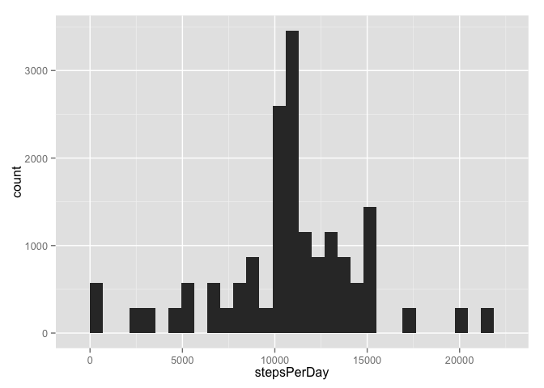
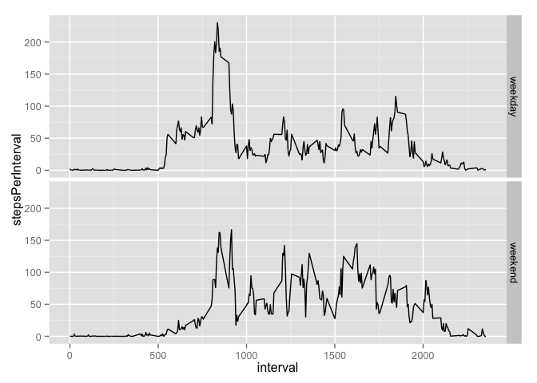

# Reproducible Research: Peer Assessment 1
John Bobo  


## Loading and preprocessing the data
First we load the data:

```r
amd = read.csv("/Users/johnbobo/data_science/datasciencecoursera/reproducible_research/RepData_PeerAssessment1/activity.csv")
```

***

## What is mean total number of steps taken per day?
We use dplyr to group by date and then find the average steps per day:


```r
library(dplyr)
```

```
## 
## Attaching package: 'dplyr'
## 
## The following object is masked from 'package:stats':
## 
##     filter
## 
## The following objects are masked from 'package:base':
## 
##     intersect, setdiff, setequal, union
```

```r
library(ggplot2)
amd_by_day <-amd %>%
            group_by(date) %>%
                mutate(stepsPerDay = sum(steps))
mean(amd_by_day$stepsPerDay, na.rm = TRUE)
```

```
## [1] 10766.19
```

```r
sum(amd$steps, na.rm=TRUE)
```

```
## [1] 570608
```
**Mean steps taken per day**: 10766
**Total steps taken**: 570608

Now we will construct a histogram of the total number of steps taken each day:

```r
qplot(stepsPerDay, data = amd_by_day)
```

```
## stat_bin: binwidth defaulted to range/30. Use 'binwidth = x' to adjust this.
```

 

Finally, we calculate the mean and median of the total steps per day (removing NA
values):

```r
mean(amd_by_day$stepsPerDay, na.rm = TRUE)
```

```
## [1] 10766.19
```

```r
median(amd_by_day$stepsPerDay, na.rm = TRUE)
```

```
## [1] 10765
```
This confirms the results in our histogram above.

To recap:

1. Total steps taken: 570608
2. Our above histogram above makes our median calculations appear reasonable.
3. The mean steps per day and median steps per day are 10766.19 and 10765, 
respectively.

***

## What is the average daily activity pattern?

To find the average daily activity pattern, we will group by interval then average
steps over that interval for all days. Then we will plot interval versus average
number of steps.

```r
amd_by_interval <- amd %>%
    group_by(interval) %>%
        mutate(stepsPerInterval = mean(steps, na.rm = TRUE))
qplot(interval, stepsPerInterval, data = amd_by_interval, geom = c("line"))
```

 

Now let us compute the 5 minute interval which on average had the most steps:

```r
amd_by_interval$interval[which.max(amd_by_interval$stepsPerInterval)]
```

```
## [1] 835
```
Giving us interval 835, just as suggested from our plot above.

## Imputing missing values
There are a number of days/intervals with missing values. These missing values may
introduce bias into some of the calculations or summaries of the data.

First, let us discover the the total number of rows with missing values in the 
dataset:

```r
sum(is.na(amd))
```

```
## [1] 2304
```
So we have 2304 NA values in our dataset. We will now replace all of these NA values
with the mean number of steps for that interval over all days.

We will make a vector of the median number of steps for each interval (excluding NAs)
and use that value in place of the NAs to create a new dataframe with no NAs

```r
new_steps = amd$steps
for (i in 1:length(new_steps)) {
    if (is.na(amd$steps[i])) {
        new_steps[i] = amd_by_interval$stepsPerInterval[i]
    }
}
new_amd  = amd
new_amd$steps = new_steps
```
Now lets look at a histogram of steps per day and compare the new mean and median 
to the old one:

```r
new_amd_by_day <-new_amd %>%
            group_by(date) %>%
                mutate(stepsPerDay = sum(steps))
qplot(stepsPerDay, data = new_amd_by_day)
```

```
## stat_bin: binwidth defaulted to range/30. Use 'binwidth = x' to adjust this.
```

 

```r
mean(new_amd_by_day$stepsPerDay)
```

```
## [1] 10766.19
```

```r
median(amd_by_day$stepsPerDay, na.rm=TRUE)
```

```
## [1] 10765
```

Our new mean and median are the same as our old ones.


## Are there differences in activity patterns between weekdays and weekends?
Here we will see if there are differences during the week versus the weekend.
First we will add a column to our new_amd dataframe for weekday

```r
weekday = vector(length=length(new_amd$date))
weekend_days = c("Sunday","Saturday")
for (i in 1:length(new_amd$date)) {
    if (weekdays(as.Date(amd$date[i])) %in% weekend_days) {
        weekday[i] = "weekend"
    }
    else {
        weekday[i] = "weekday"
    }
}
new_amd$weekday = weekday
```
Now we need the mean steps per interval grouped by weekday

```r
new_amd_weekday <- new_amd %>%
    filter(weekday == "weekday") %>%
        group_by(interval) %>%
            mutate(stepsPerInterval = mean(steps, na.rm = TRUE))

new_amd_weekend <- new_amd %>%
    filter(weekday == "weekend") %>%
        group_by(interval) %>%
            mutate(stepsPerInterval = mean(steps, na.rm = TRUE))
new_amd_by_weekday = rbind(new_amd_weekday,new_amd_weekend)
```
Now we'll plot a time series to see the difference

```r
qplot(interval, stepsPerInterval, data = new_amd_by_weekday, geom = c("line"), facets=weekday~.)
```

 

